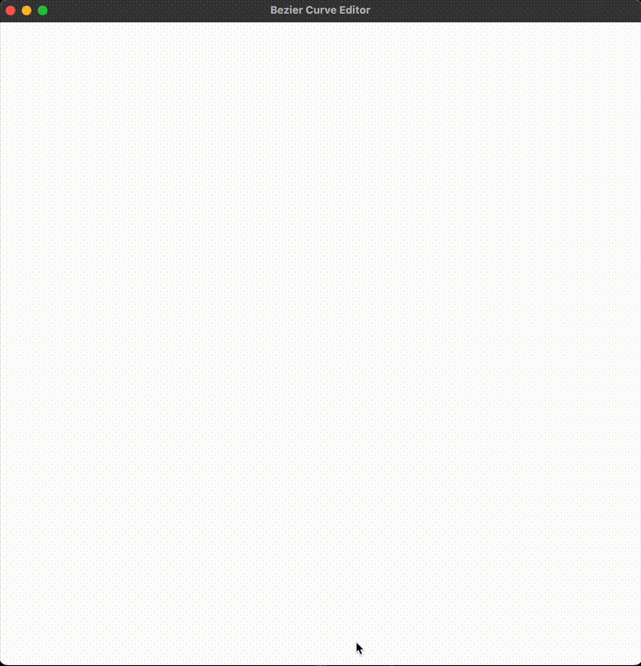

## OpenGL Bezier Curve Editor



This project is a fully interactive Bezier spline editor built in Python and OpenGL.

The project's goal was to implement a tool that mimics the **"pen tool"** seen in vector graphics editors — allowing users to **add, move, and manipulate nodes and control points** on a smooth, real-time Bezier spline.

### How to Use
Install the required packages from `requirements.txt`.
Run the application with:
```python
python main.py <window_width> <window_height>
```

### What Was Accomplished

- **Cubic Bezier Spline Creation**: Users can click to create new spline nodes and dynamically build a continuous curve in any shape they want.
- **Interactive Dragging**: Nodes and their control points can be clicked and dragged in real time, updating the spline instantly. Intermediate nodes maintain **colinear control points** and **equal distances** during interaction, which was both a geometric and implementation challenge.
- **Automatic Node Insertion**: When new nodes are inserted, the nearest endpoint is converted into an intermediate node with an added control point, following strict spatial rules. This gives the spline a smart, self-updating behavior.
- **Crisp, Smooth Rendering**: Implemented full anti-aliasing, multisampling, and smooth point/line rendering. Nodes are rendered as square points, control handles as circular ones, and dotted lines connect control points to their associated nodes.
- **HDPI & Resolution Handling**: Ensured that input, rendering, and projection all work cleanly across high-resolution displays, using framebuffer dimensions for accuracy.
- **Reset Functionality**: Pressing `E` clears the canvas, allowing for quick resets and experimentation.

### Why I learned

This was one of my first deep dives into OpenGL, and it gave me a solid foundation in the graphics pipeline — setting up projection matrices, configuring framebuffers, and managing real-time rendering. I implemented a cubic Bézier spline editor entirely in immediate mode OpenGL, which meant handling all geometry and rendering logic myself.

What made this project technically engaging was enforcing Bézier spline constraints in real-time — especially keeping control points colinear and equidistant relative to their central node. Doing this with minimal data (storing control points relative to nodes) made the math both cleaner and more interesting. It also exposed me to the quirks of HDPI rendering, multisampling, and how OpenGL maps to windowing systems like GLFW.
